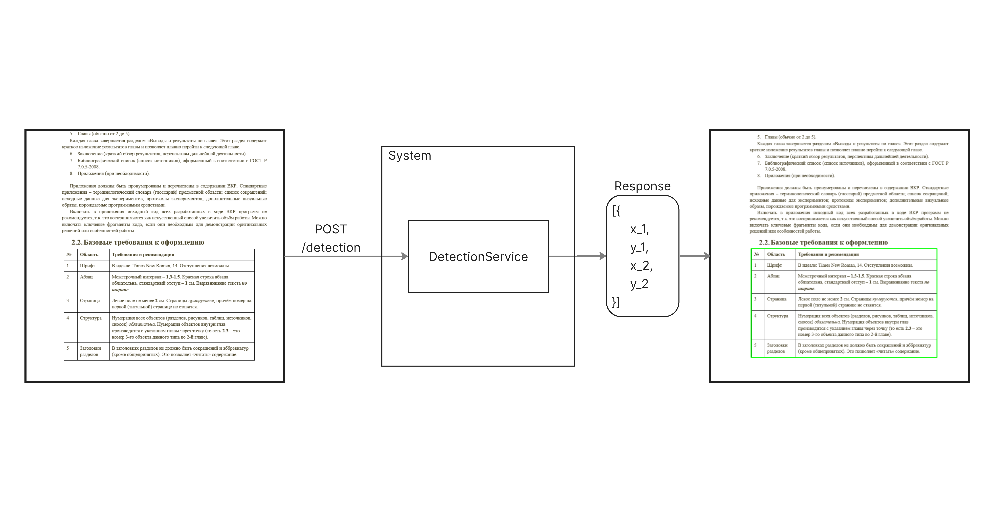

# table-parser

Система для автоматического распознавания таблиц в документах и изображениях. Объединяет детекцию таблиц (YOLOv8), OCR (Tesseract/EasyOCR) и постобработку текста (ruT5-ASR) в единый пайплайн, пригодный для интеграции и мониторинга.

---

## System overview

Архитектура состоит из нескольких независимых сервисов:

  

- **DetectionService** — обнаружение таблиц на изображениях (YOLOv8)
- **PreprocessService** — извлечение страниц из PDF и подготовка изображений
- **RecognitionService** — распознавание структуры таблиц и извлечение текста
- **Monitoring** — Prometheus + Grafana для отслеживания состояния компонентов

---

## DetectionService

  

- Принимает изображения и возвращает координаты таблиц (bbox)
- Поддерживает модели в формате `.pt`
- REST API: `POST /detect`

---

## YoloV8

Обучение модели производилось на датасете [TableBank](https://github.com/doc-analysis/TableBank) (в режиме Detection).

  

- Используется `ultralytics` для обучения и инференса
- Поддерживается дообучение и экспорт моделей в другие форматы

---

## RecognitionService

Компонент, отвечающий за распознавание **структуры таблицы** и **содержимого ячеек**.

  

- OCR через Tesseract или EasyOCR
- Геометрический анализ таблицы на основе OpenCV
- Постобработка текста с помощью модели [ruT5-ASR-large](https://huggingface.co/bond005/ruT5-ASR-large)
- Вывод в формате `List[List[str]]` (можно сериализовать в CSV/JSON/HTML)

---

## Распознавание структуры таблицы

  

---

## Deploy

Для удобства развертывания и масштабирования система была полностью контейнеризирована с использованием Docker. Каждый компонент работает в отдельном изолированном контейнере.

---

## Grafana integration

Для мониторинга компонентов системы используется стек Prometheus + Grafana.
Каждый микросервис (например, DetectionService и RecognitionService) содержит встроенный экспорт метрик через Prometheus FastAPI Instrumentator.

  

---
